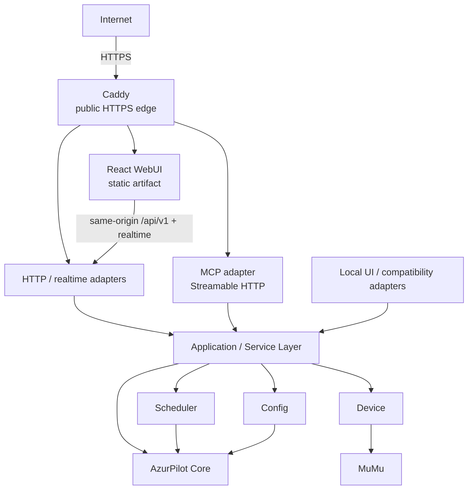
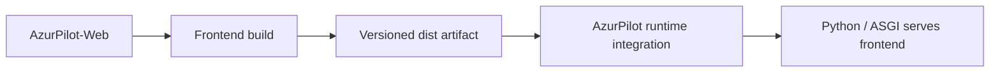
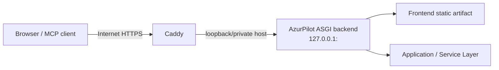

# AzurPilot-Web Architecture Baseline

Status: **Accepted baseline for Stage 0**  
Scope: repository boundary, runtime topology, API/MCP ownership, trust boundaries, and delivery model.  
Implementation status: **target design unless explicitly marked current state**.

## 1. Purpose

AzurPilot-Web is the future browser client for AzurPilot. Stage 0 deliberately defines boundaries before frontend scaffolding so that UI development cannot accidentally duplicate privileged backend behavior or expose AzurPilot internals as browser concerns.

This document separates **current state** from **target state**. A target diagram or rule is not evidence that the corresponding implementation already exists.

## 2. Current state

The current WebUI lives in `AliceLiddell01/AzurPilot-private-Ru` and remains the source of truth for runtime behavior.

Verified on `personal/stable@3be3696975cb91ba0b85dbea98400381c3ced379` during Stage 0:

- the main WebUI is Python/PyWebIO-based and is assembled in `module/webui/app.py`;
- `module/webui/fastapi.py` builds a Starlette ASGI application around PyWebIO and appends additional API routes;
- `module/webui/api.py` already contains partial REST, SSE/streaming and WebSocket endpoints, including statistics, notification/launcher streams, screenshots and device-control behavior;
- remote-access infrastructure already exists in `module/webui/remote_access.py`;
- `module/webui/process_manager.py` directly owns worker-process lifecycle and is privileged runtime code;
- `mcp_server_sse.py` already provides MCP over the legacy HTTP+SSE transport and is mounted by the WebUI application;
- the legacy MCP implementation directly imports or instantiates runtime internals including `ProcessManager`, `AzurLaneConfig`, `Device`, config helpers, local logs and ADB/emulator operations;
- some local-only behavior is gated by `module/webui/launcher.py::is_local_request()`, which reasons about the direct client host and HTTP `Host` header;
- a complete application/service layer that cleanly mediates HTTP, WebUI and MCP business actions is **not yet established** as the shared target boundary;
- a React frontend does **not** yet exist in this repository.

Current code references:

- `module/webui/app.py`: <https://github.com/AliceLiddell01/AzurPilot-private-Ru/blob/personal/stable/module/webui/app.py>
- `module/webui/fastapi.py`: <https://github.com/AliceLiddell01/AzurPilot-private-Ru/blob/personal/stable/module/webui/fastapi.py>
- `module/webui/api.py`: <https://github.com/AliceLiddell01/AzurPilot-private-Ru/blob/personal/stable/module/webui/api.py>
- `module/webui/remote_access.py`: <https://github.com/AliceLiddell01/AzurPilot-private-Ru/blob/personal/stable/module/webui/remote_access.py>
- `module/webui/process_manager.py`: <https://github.com/AliceLiddell01/AzurPilot-private-Ru/blob/personal/stable/module/webui/process_manager.py>
- `mcp_server_sse.py`: <https://github.com/AliceLiddell01/AzurPilot-private-Ru/blob/personal/stable/mcp_server_sse.py>

### Current-state security debt relevant to migration

The existing system was not designed around the final public reverse-proxy boundary described below. In particular:

- legacy MCP uses the superseded SSE transport and currently contains direct privileged operations;
- the standalone legacy MCP entry point can bind to all interfaces and its Starlette wrapper currently permits wildcard CORS;
- direct-local request checks cannot be generalized into "the TCP peer is loopback, therefore the user is trusted" after a reverse proxy is introduced;
- existing API surface is real but is not evidence that a stable, versioned React contract is already complete.

These observations are migration inputs, not a request to rewrite backend code in Stage 0.

## 3. Target system context



The central rule is adapter convergence: browser HTTP, MCP and any local compatibility UI call the **same backend application/service capabilities** instead of each implementing its own business logic.

## 4. Repository ownership

`AzurPilot-Web` is **frontend-only**. The delivery unit is a **versioned static frontend artifact**; privileged runtime behavior stays backend-side.

### AzurPilot-Web owns

- React UI;
- TypeScript frontend code;
- frontend routing;
- client-local state;
- API client code;
- design system;
- frontend tests;
- frontend build configuration;
- the versioned frontend build artifact.

### AzurPilot-Web does not own

- AzurPilot business logic;
- scheduler behavior;
- `ProcessManager`;
- direct config-file access;
- SQLite or other backend storage;
- ADB or MuMu control;
- OCR/game automation;
- server-side authentication/authorization implementation;
- MCP server implementation;
- Caddy runtime management.

### AzurPilot-private-Ru remains the target owner of

- application/service layer;
- versioned HTTP API and realtime endpoints;
- server-side authentication and authorization;
- MCP adapter/server;
- process/config/storage/device/MuMu integration;
- policy enforcement for destructive operations;
- integration and serving of the built frontend artifact inside the AzurPilot runtime.

## 5. Dependency direction

The browser may know only stable public contract concepts. It must not couple itself to Python implementation details.

Forbidden target dependencies include:

```text
frontend -> ProcessManager
frontend -> config/*.json
frontend -> SQLite file
frontend -> MuMu process
frontend -> Python class/module names
```

The permitted direction is:

```text
React -> versioned backend contract -> application/service layer -> runtime internals
```

Likewise, the target MCP direction is:

```text
MCP protocol adapter -> application/service layer -> runtime internals
```

Direct MCP-to-`ProcessManager`, MCP-to-config-file, or MCP-to-`Device` implementations are legacy debt, not the target design.

## 6. Application/service layer

The application/service layer is the single backend business boundary shared by all adapters.

It must eventually express capabilities such as configuration mutation, scheduler mutation, instance lifecycle and device operations without exposing the implementation classes that perform them. The exact Python package layout is deferred to a backend Stage.

### Unified destructive-operation policy

Destructive or privileged actions must not gain adapter-specific escape hatches. Restart emulator, stop instance, config mutation, scheduler mutation, device control and future AI-triggered actions must pass through a common backend policy path that can enforce:

- authentication and authorization;
- input validation;
- instance/target resolution;
- safety preconditions;
- auditability;
- human-in-the-loop requirements where product policy calls for them.

## 7. HTTP API boundary

The target HTTP namespace begins at:

```text
/api/v1/...
```

Stage 0 intentionally does **not** invent the future endpoint catalogue.

Contract rules:

1. The backend is the source of truth for shared request/response schemas.
2. Frontend request/response types must not drift as manually duplicated TypeScript definitions.
3. A generated TypeScript client/types flow, or an equivalently verifiable schema pipeline, is the target direction; the concrete generator is deferred until the backend contract technology is selected.
4. Breaking API changes require an explicit versioning/migration decision rather than silent schema drift.
5. Internal Python names and storage layout are never API contract fields merely because they exist in current code.

## 8. Frontend technology direction

Stage 0 records the following direction without installing dependencies:

```text
React
TypeScript
Vite
React Router
TanStack Query
Zod
Zustand — only for genuinely client-local state
Vitest
React Testing Library
Playwright
```

Rationale:

- the product is a self-hosted control-panel SPA; SSR/SEO do not justify a Next.js runtime;
- server state should be managed as server state rather than copied into a global client store;
- runtime payloads should be validated at the client boundary;
- local UI state may use a small dedicated store only when URL state/component state/server state are not the right owners;
- unit/component tests and browser-level smoke tests are both expected once the frontend exists.

As of the Stage 0 research snapshot, React 19.2 is the current React 19 release line and Vite 8 is the current Vite major. Exact package versions belong in the future lockfile, not in this architecture baseline.

Primary references:

- React 19.2: <https://react.dev/blog/2025/10/01/react-19-2>
- Vite 8: <https://vite.dev/blog/announcing-vite8>
- Vite production build: <https://vite.dev/guide/build>

## 9. Production frontend artifact model

Node.js and pnpm are build-time tools. They are not required runtime dependencies for an end user running AzurPilot.



The integration mechanism must be explicit and versioned. A Git submodule or subtree must not become an implicit runtime coupling between the repositories without a separate ADR proving why it is necessary.

## 10. Self-hosted production topology

The deployment target is a personal self-hosted control panel on the user's own PC, not SaaS.

```text
https://<user-domain>/
https://<user-domain>/api/v1/...
wss://<user-domain>/...
https://<user-domain>/mcp
```



Caddy is the **only intended public HTTP(S) edge**. The AzurPilot backend should target a loopback/local bind such as `127.0.0.1:<backend-port>` and must not require exposing an internal application port directly to the Internet.

Caddy is chosen as the target TLS/reverse-proxy edge because it supports automatic HTTPS for correctly configured public hostnames and first-class reverse proxying. Installation, DNS, port forwarding and machine-specific configuration are out of Stage 0 scope.

Primary references:

- Caddy Automatic HTTPS: <https://caddyserver.com/docs/automatic-https>
- Caddy `reverse_proxy`: <https://caddyserver.com/docs/caddyfile/directives/reverse_proxy>

## 11. Same-origin production rule

Browser production traffic is same-origin by default. The public edge routes UI, `/api/v1/...` and realtime paths under the same origin.

Wildcard CORS is **not** the production security model. Development may later use a Vite proxy or intentionally narrow development origins, but development convenience must not redefine production trust.

## 12. Trust boundary and reverse proxy rules

A reverse proxy changes what the backend observes as its direct TCP peer. Therefore:

> A request arriving from a loopback proxy connection is not automatically a trusted local-user request.

The future backend must:

- distinguish a true direct-local request from an authenticated remote request;
- define which proxy peers are trusted;
- honor forwarded metadata only across that trusted proxy boundary;
- reject or ignore spoofable forwarding headers received outside that boundary;
- perform authorization in backend code regardless of frontend behavior.

The current `is_local_request()` behavior is a current-state implementation detail and must be revisited during backend proxy/auth migration; Stage 0 does not replace it.

## 13. Authentication contracts

Web/browser authentication and MCP authentication are separate security contracts.

They may later share an identity provider or authorization core, but a browser session cookie must not be assumed to be a universal MCP credential. Each adapter needs an explicit credential transport, authorization model, CSRF/origin considerations where applicable, revocation/expiry behavior and audit semantics.

The exact auth technology is deferred because choosing it before the public API/service boundary is implemented would be premature.

## 14. MCP boundary

### Current state

`mcp_server_sse.py` is a real legacy MCP adapter in the backend/core repository. It currently:

- uses `SseServerTransport`;
- exposes tools that directly reach `ProcessManager`, `AzurLaneConfig`, `Device`, scheduler/config state, logs, ADB and emulator operations;
- is mounted under the existing WebUI ASGI application;
- also contains a standalone server path.

### Target state

MCP stays in `AzurPilot-private-Ru`; `AzurPilot-Web` has no dependency on the MCP Python SDK.

```text
MCP client -> Caddy -> /mcp -> MCP adapter -> application/service layer -> AzurPilot runtime
```

Target transport: **Streamable HTTP**. The MCP specification states that Streamable HTTP replaced the old HTTP+SSE transport, and the official Python SDK recommends Streamable HTTP for deployed servers. Legacy SSE may exist only as a temporary compatibility concern when proven necessary.

MCP capabilities should be modelled by their protocol purpose rather than putting everything into tools:

- **Resources**: readable context/data exposed as resources when that semantic fits;
- **Prompts**: reusable prompt templates/workflows when useful;
- **Tools**: callable operations, especially actions with parameters or side effects.

Write/destructive MCP tools require backend permissions, validation, audit controls and human-in-the-loop policy where necessary. `/mcp` must not be published as a separate unauthenticated raw backend port.

Primary references:

- MCP transport specification: <https://modelcontextprotocol.io/specification/2025-03-26/basic/transports>
- Official Python SDK server transport guidance: <https://github.com/modelcontextprotocol/python-sdk/blob/main/docs/run/index.md>
- Official Python SDK ASGI integration guidance: <https://github.com/modelcontextprotocol/python-sdk/blob/main/docs/run/asgi.md>

## 15. Instance model

The initial deployment may be one PC and one user, but the contract must not permanently encode "the only instance is localhost".

Identifiers and service methods should permit explicit instance/target addressing where the domain requires it. This is not permission to design a cloud multi-tenant SaaS platform; it only avoids an unnecessary single-instance trap in the public contract.

## 16. Migration constraints

Future Stages must preserve these constraints:

1. Introduce/refine backend application services before exposing new privileged actions to React or MCP.
2. Do not migrate PyWebIO behavior by copying direct runtime calls into TypeScript.
3. Do not treat the current unversioned/legacy API as automatically fit for the React contract.
4. Move browser-facing endpoints toward `/api/v1/...` with backend-owned schemas.
5. Integrate the built frontend as an artifact, not by requiring a Node development server in production.
6. Introduce trusted-proxy and remote-auth semantics before public Caddy exposure.
7. Migrate MCP business actions to shared services before expanding privileged AI control.
8. Preserve a compatibility path only when there is a demonstrated user/runtime requirement.

Examples of likely backend prerequisites, to be delivered in later backend work rather than Stage 0:

```text
Future backend prerequisite: introduce a ConfigService boundary before exposing config mutation through /api/v1 and MCP.
Future backend prerequisite: introduce an InstanceLifecycleService boundary before React/MCP control start/stop/restart actions.
Future backend prerequisite: define trusted-proxy and authenticated-remote request semantics before Caddy-backed public access.
```

## 17. Explicit non-goals

Stage 0 does not choose or implement:

- a SaaS or multi-tenant cloud architecture;
- Kubernetes or microservices;
- a separate VPS requirement;
- Next.js/SSR for its own sake;
- a database migration;
- Caddy machine configuration;
- router/DNS setup;
- concrete browser or MCP auth technology;
- a full API endpoint catalogue;
- an API type generator;
- React scaffolding, package versions or a lockfile;
- backend refactors;
- a new MCP server;
- a deployment/release pipeline.

## 18. Deferred decisions

The following are intentionally deferred until there is enough implementation evidence:

| Decision | Why deferred |
| --- | --- |
| Backend schema/OpenAPI source technology and TypeScript generator | Must align with the actual backend contract implementation, not speculation. |
| Browser auth mechanism | Depends on deployment/auth requirements and backend threat model. |
| MCP auth mechanism | Separate protocol/security contract; should align with supported MCP clients and backend authorization. |
| Realtime transport/path details | Must be driven by concrete UI use cases and existing backend behavior. |
| Frontend artifact versioning/packaging format | Requires Stage 1 build output and backend integration constraints. |
| Compatibility lifetime for legacy PyWebIO/MCP SSE | Requires migration rollout evidence. |
| Exact frontend package versions | Belongs in the scaffold lockfile. |

## 19. Architecture acceptance test

A future contributor should be able to answer these questions from this baseline without guessing:

| Question | Baseline answer |
| --- | --- |
| Who owns the frontend? | `AzurPilot-Web`. |
| Who owns API/server auth/runtime integration? | `AzurPilot-private-Ru`. |
| Where does MCP live? | `AzurPilot-private-Ru`. |
| Where does business logic live? | Behind the backend application/service layer. |
| May React read config files or SQLite directly? | No. |
| May target MCP tools call `ProcessManager` directly? | No; they call the shared service boundary. |
| Who owns shared API schemas? | Backend is source of truth. |
| How does frontend reach production? | As a versioned static build artifact integrated into AzurPilot runtime. |
| What is the public edge? | Caddy over HTTPS. |
| Does a loopback reverse-proxy peer imply local-user trust? | No. |
| Is current backend API already the final React API? | No. |
| Is the auth technology decided? | No; separation and backend enforcement are decided, exact mechanism is deferred. |
