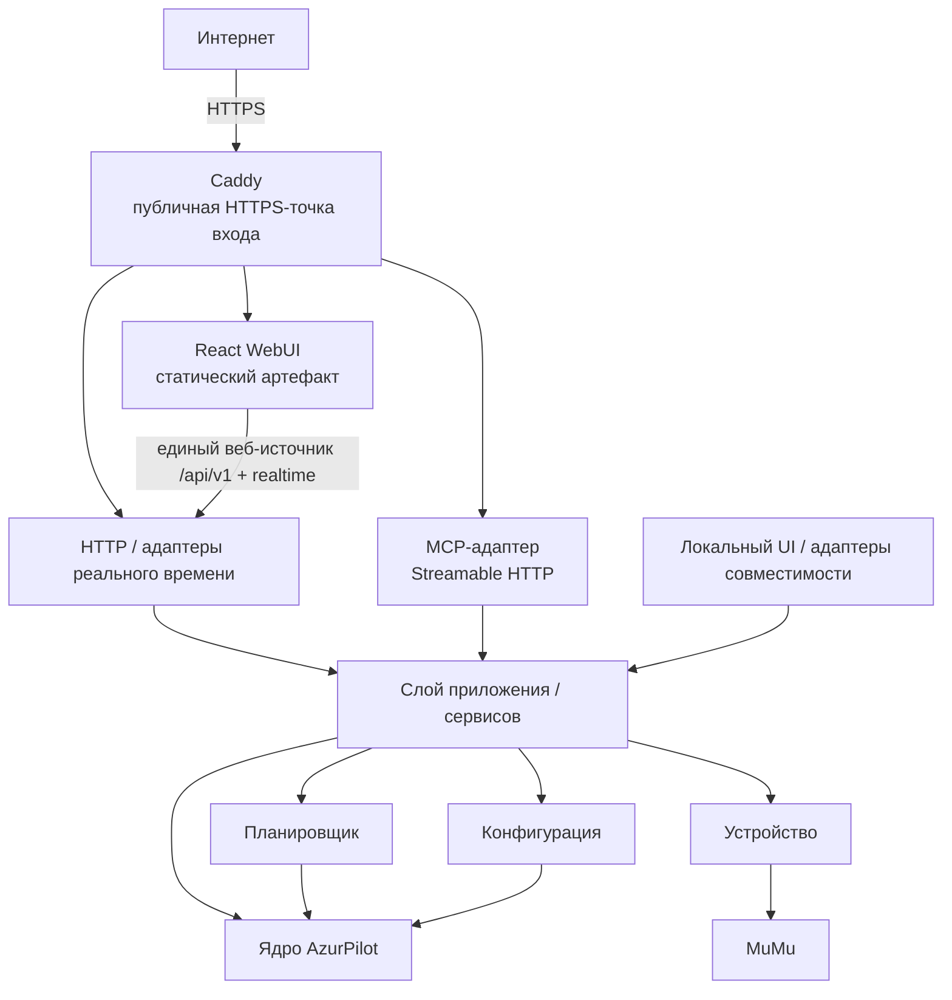
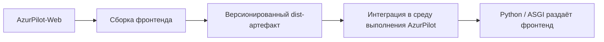
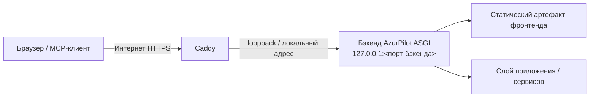

# Архитектурная основа AzurPilot-Web

Статус: **Принято как архитектурная основа Этапа 0**  
Область: граница репозитория, топология среды выполнения, владение API/MCP, границы доверия и модель поставки.  
Состояние реализации: **целевая архитектура, если раздел явно не помечен как текущее состояние**.

## 1. Назначение

AzurPilot-Web — будущий браузерный клиент AzurPilot. Этап 0 намеренно фиксирует границы до создания основы фронтенда, чтобы разработка интерфейса не смогла случайно продублировать привилегированное поведение бэкенда или превратить внутренности AzurPilot в заботу браузера.

Этот документ разделяет **текущее состояние** и **целевое состояние**. Целевая диаграмма или правило не являются доказательством, что соответствующая реализация уже существует.

## 2. Текущее состояние

Текущий WebUI находится в `AliceLiddell01/AzurPilot-private-Ru` и остаётся источником истины о фактическом поведении среды выполнения.

Проверено на `personal/stable@3be3696975cb91ba0b85dbea98400381c3ced379` во время Этапа 0:

- основной WebUI построен на Python/PyWebIO и собирается в `module/webui/app.py`;
- `module/webui/fastapi.py` создаёт Starlette ASGI-приложение вокруг PyWebIO и добавляет дополнительные API-маршруты;
- `module/webui/api.py` уже содержит частичные REST-, SSE/streaming- и WebSocket-маршруты, включая статистику, потоки уведомлений/лаунчера, снимки экрана и управление устройством;
- инфраструктура удалённого доступа уже существует в `module/webui/remote_access.py`;
- `module/webui/process_manager.py` напрямую владеет жизненным циклом рабочих процессов и является привилегированным кодом среды выполнения;
- `mcp_server_sse.py` уже предоставляет MCP через устаревший HTTP+SSE-транспорт и монтируется текущим WebUI-приложением;
- устаревший MCP напрямую импортирует или создаёт компоненты среды выполнения, включая `ProcessManager`, `AzurLaneConfig`, `Device`, вспомогательные объекты конфигурации, локальные логи, ADB и операции эмулятора;
- часть поведения, доступного только локально, защищается через `module/webui/launcher.py::is_local_request()`, который анализирует прямой адрес клиента и HTTP-заголовок `Host`;
- законченный слой приложения/сервисов, который единообразно посредничает между HTTP, WebUI и MCP, **ещё не сформирован** как общая целевая граница;
- React-фронтенда в этом репозитории **пока нет**.

Ссылки на код текущего состояния:

- `module/webui/app.py`: <https://github.com/AliceLiddell01/AzurPilot-private-Ru/blob/personal/stable/module/webui/app.py>
- `module/webui/fastapi.py`: <https://github.com/AliceLiddell01/AzurPilot-private-Ru/blob/personal/stable/module/webui/fastapi.py>
- `module/webui/api.py`: <https://github.com/AliceLiddell01/AzurPilot-private-Ru/blob/personal/stable/module/webui/api.py>
- `module/webui/remote_access.py`: <https://github.com/AliceLiddell01/AzurPilot-private-Ru/blob/personal/stable/module/webui/remote_access.py>
- `module/webui/process_manager.py`: <https://github.com/AliceLiddell01/AzurPilot-private-Ru/blob/personal/stable/module/webui/process_manager.py>
- `mcp_server_sse.py`: <https://github.com/AliceLiddell01/AzurPilot-private-Ru/blob/personal/stable/mcp_server_sse.py>

### Технический долг безопасности, важный для миграции

Существующая система не проектировалась вокруг финальной публичной границы обратного прокси, описанной ниже. В частности:

- устаревший MCP использует старый SSE-транспорт и сейчас содержит прямые привилегированные операции;
- самостоятельный режим устаревшего MCP может слушать все интерфейсы, а его Starlette-обёртка сейчас разрешает wildcard CORS;
- текущие проверки «локальности» нельзя после появления обратного прокси обобщить до правила «TCP peer равен loopback, значит пользователь доверенный»;
- наличие текущего API не означает, что стабильный версионированный контракт для React уже завершён.

Это входные данные для миграции, а не требование переписывать код бэкенда в Этапе 0.

## 3. Целевой системный контекст



Центральное правило — сходящиеся адаптеры: браузерный HTTP, MCP и любой локальный UI совместимости обращаются к **одним и тем же возможностям слоя приложения/сервисов бэкенда**, а не реализуют бизнес-логику независимо.

## 4. Владение репозиториями

`AzurPilot-Web` является репозиторием **только фронтенда**. Единица поставки — **версионированный статический артефакт фронтенда**; привилегированное поведение среды выполнения остаётся на стороне бэкенда.

### AzurPilot-Web владеет

- React UI;
- фронтенд-кодом на TypeScript;
- фронтенд-маршрутизацией;
- локальным клиентским состоянием;
- API-клиентом;
- дизайн-системой;
- фронтенд-тестами;
- фронтенд-сборкой;
- версионированным артефактом фронтенд-сборки.

### AzurPilot-Web не владеет

- бизнес-логикой AzurPilot;
- логикой планировщика;
- `ProcessManager`;
- прямым доступом к config-файлам;
- SQLite и другими хранилищами бэкенда;
- ADB или управлением MuMu;
- OCR/игровой автоматизацией;
- серверной реализацией аутентификации и авторизации;
- MCP-сервером;
- управлением Caddy во время работы системы.

### Целевым владельцем в AzurPilot-private-Ru остаются

- слой приложения/сервисов;
- версионированный HTTP API и маршруты реального времени;
- серверная аутентификация и авторизация;
- MCP-адаптер/сервер;
- интеграция процессов, конфигурации, хранилищ, устройства и MuMu;
- единая политика разрушительных операций;
- интеграция и раздача собранного фронтенд-артефакта внутри среды выполнения AzurPilot.

## 5. Направление зависимостей

Браузер может знать только понятия стабильного публичного контракта. Он не должен связываться с деталями Python-реализации.

Запрещённые целевые зависимости:

```text
фронтенд -> ProcessManager
фронтенд -> config/*.json
фронтенд -> SQLite-файл
фронтенд -> процесс MuMu
фронтенд -> имена Python-классов/модулей
```

Разрешённое направление:

```text
React -> версионированный контракт бэкенда -> слой приложения/сервисов -> внутренности среды выполнения
```

Целевое направление MCP:

```text
MCP-протокольный адаптер -> слой приложения/сервисов -> внутренности среды выполнения
```

Прямые `MCP -> ProcessManager`, `MCP -> config-файл` или `MCP -> Device` являются устаревшим техническим долгом, а не целевой архитектурой.

## 6. Слой приложения/сервисов

Слой приложения/сервисов — единая бизнес-граница бэкенда для всех адаптеров.

Со временем он должен выражать возможности вроде изменения конфигурации, изменения планировщика, управления жизненным циклом экземпляров и операций устройства, не раскрывая наружу классы реализации. Точная структура Python-пакетов откладывается до отдельного этапа бэкенда.

### Единая политика разрушительных операций

Разрушительные и привилегированные действия не должны получать специфичные для адаптера обходные пути. Перезапуск эмулятора, остановка экземпляра, изменение конфигурации, изменение планировщика, управление устройством и будущие AI-команды должны проходить через общий слой политик бэкенда, который способен обеспечивать:

- аутентификацию и авторизацию;
- валидацию входных данных;
- разрешение экземпляра/цели;
- проверки безопасных предусловий;
- аудит;
- участие человека там, где этого требует продуктовая политика.

## 7. Граница HTTP API

Целевое пространство HTTP-маршрутов начинается с:

```text
/api/v1/...
```

Этап 0 намеренно **не придумывает** полный каталог будущих маршрутов.

Правила контракта:

1. Бэкенд является источником истины для общих схем запросов и ответов.
2. Типы запросов/ответов во фронтенде не должны бесконтрольно расходиться как вручную продублированные TypeScript-описания.
3. Целевое направление — сгенерированные TypeScript-клиент/типы либо эквивалентная проверяемая схема; конкретный генератор откладывается до выбора технологии контракта бэкенда.
4. Ломающие API-изменения требуют явного решения по версионированию/миграции, а не тихого дрейфа схемы.
5. Внутренние Python-имена и структура хранилищ не становятся полями API-контракта только потому, что существуют в текущем коде.

## 8. Направление фронтенд-стека

Этап 0 фиксирует следующее направление без установки зависимостей:

```text
React
TypeScript
Vite
React Router
TanStack Query
Zod
Zustand — только для действительно локального клиентского состояния
Vitest
React Testing Library
Playwright
```

Причины:

- продукт — самостоятельно размещаемая SPA-панель управления; SSR/SEO не дают оснований усложнять среду выполнения через Next.js;
- серверное состояние должно управляться как серверное состояние, а не копироваться в глобальное клиентское хранилище;
- данные времени выполнения необходимо валидировать на клиентской границе;
- локальное UI-состояние может использовать небольшой отдельный store только когда состояние URL, состояние компонента и серверное состояние не подходят;
- после появления фронтенда ожидаются модульные/компонентные тесты и браузерные smoke-тесты.

На момент исследовательского среза Этапа 0 React 19.2 является текущей линией React 19, а Vite 8 — текущей основной веткой Vite. Точные версии пакетов должны жить в будущем lockfile, а не в архитектурной основе.

Первичные источники:

- React 19.2: <https://react.dev/blog/2025/10/01/react-19-2>
- Vite 8: <https://vite.dev/blog/announcing-vite8>
- Сборка Vite для рабочей эксплуатации: <https://vite.dev/guide/build>

## 9. Модель артефакта фронтенда для рабочей эксплуатации

Node.js и pnpm — инструменты времени сборки. Они не являются обязательными зависимостями среды выполнения конечного пользователя AzurPilot.



Механизм интеграции должен быть явным и версионированным. Git submodule или subtree не должен становиться неявной связью между репозиториями во время выполнения без отдельного ADR с доказанной необходимостью.

## 10. Топология самостоятельно размещаемой рабочей системы

Целевое развёртывание — персональная панель управления на компьютере пользователя, а не SaaS.

```text
https://<домен-пользователя>/
https://<домен-пользователя>/api/v1/...
wss://<домен-пользователя>/...
https://<домен-пользователя>/mcp
```



Caddy — **единственная целевая публичная HTTP(S)-точка входа**. Бэкенд AzurPilot должен в целевой схеме слушать loopback/локальный адрес, например `127.0.0.1:<порт-бэкенда>`, и не требовать прямой публикации внутреннего порта приложения в Интернет.

Caddy выбран как целевая точка завершения TLS и обратного проксирования, потому что поддерживает автоматический HTTPS для корректно настроенных публичных имён и полноценный reverse proxy. Установка, DNS, проброс портов и машинно-зависимая конфигурация не входят в Этап 0.

Первичные источники:

- Automatic HTTPS Caddy: <https://caddyserver.com/docs/automatic-https>
- `reverse_proxy` Caddy: <https://caddyserver.com/docs/caddyfile/directives/reverse_proxy>

## 11. Правило единого веб-источника для рабочей эксплуатации

Браузерный трафик рабочей эксплуатации по умолчанию работает через один origin. Публичная точка входа маршрутизирует UI, `/api/v1/...` и пути реального времени внутри одного origin.

Wildcard CORS **не является** моделью безопасности рабочей эксплуатации. Среда разработки позже может использовать Vite proxy или намеренно ограниченные origins разработки, но удобство разработки не должно переопределять границу доверия рабочей системы.

## 12. Граница доверия и правила обратного прокси

Обратный прокси меняет то, кого бэкенд видит как прямого TCP peer. Поэтому:

> Запрос, пришедший по loopback-соединению от обратного прокси, не становится автоматически доверенным локальным запросом пользователя.

Будущий бэкенд обязан:

- отличать настоящий прямой локальный запрос от аутентифицированного удалённого запроса;
- явно определять доверенные прокси;
- учитывать перенаправленные метаданные только внутри доверенной прокси-границы;
- отвергать или игнорировать подделываемые заголовки перенаправления вне этой границы;
- выполнять авторизацию на стороне бэкенда независимо от поведения фронтенда.

Текущий `is_local_request()` — деталь текущей реализации, которую необходимо пересмотреть во время миграции бэкенда к прокси/аутентификации; Этап 0 её не заменяет.

## 13. Контракты аутентификации

Веб-аутентификация и MCP-аутентификация являются разными контрактами безопасности.

Позже они могут использовать общий поставщик идентификации или общий слой авторизации, но cookie браузерной сессии нельзя автоматически считать универсальным MCP-учётным данным. Каждому адаптеру нужен явный способ передачи учётных данных, модель авторизации, правила CSRF/origin там, где они применимы, отзыв/срок действия и семантика аудита.

Конкретная технология аутентификации откладывается: фиксировать её до реализации публичного API и сервисной границы преждевременно.

## 14. Граница MCP

### Текущее состояние

`mcp_server_sse.py` — реальный устаревший MCP-адаптер в репозитории бэкенда/ядра. Сейчас он:

- использует `SseServerTransport`;
- содержит Tools, которые напрямую обращаются к `ProcessManager`, `AzurLaneConfig`, `Device`, состоянию планировщика/конфигурации, логам, ADB и операциям эмулятора;
- монтируется внутри существующего WebUI ASGI-приложения;
- также содержит самостоятельный серверный режим.

### Целевое состояние

MCP остаётся в `AzurPilot-private-Ru`; `AzurPilot-Web` не зависит от MCP Python SDK.

```text
MCP-клиент -> Caddy -> /mcp -> MCP-адаптер -> слой приложения/сервисов -> среда выполнения AzurPilot
```

Целевой транспорт: **Streamable HTTP**. Спецификация MCP указывает, что Streamable HTTP заменил старый HTTP+SSE-транспорт, а официальный Python SDK рекомендует Streamable HTTP для развёрнутых серверов. Старый SSE может оставаться только как временная задача совместимости при доказанной необходимости.

Возможности MCP следует моделировать по смыслу протокола, а не складывать всё в Tools:

- **Resources** — читаемый контекст/данные, если это соответствует их смыслу;
- **Prompts** — переиспользуемые шаблоны/сценарии запросов, где это полезно;
- **Tools** — вызываемые операции, особенно действия с параметрами или побочными эффектами.

Изменяющие состояние и разрушительные MCP Tools требуют серверных разрешений, валидации, аудита и участия человека там, где это необходимо. `/mcp` не должен публиковаться как отдельный неаутентифицированный порт бэкенда.

Первичные источники:

- спецификация транспорта MCP: <https://modelcontextprotocol.io/specification/2025-03-26/basic/transports>
- руководство официального Python SDK по серверному транспорту: <https://github.com/modelcontextprotocol/python-sdk/blob/main/docs/run/index.md>
- руководство официального Python SDK по интеграции ASGI: <https://github.com/modelcontextprotocol/python-sdk/blob/main/docs/run/asgi.md>

## 15. Модель экземпляров

Начальное развёртывание может состоять из одного компьютера и одного пользователя, но контракт не должен навсегда кодировать правило «единственный экземпляр — это localhost».

Идентификаторы и методы сервисов должны позволять явное указание экземпляра/цели там, где этого требует предметная модель. Это не разрешение проектировать облачный multi-tenant SaaS; задача только в том, чтобы не зашить ненужное ограничение на один экземпляр в публичный контракт.

## 16. Ограничения миграции

Будущие Этапы обязаны сохранять следующие ограничения:

1. Вводить или уточнять сервисы приложения на стороне бэкенда до публикации новых привилегированных действий через React или MCP.
2. Не переносить PyWebIO-поведение путём копирования прямых вызовов среды выполнения в TypeScript.
3. Не считать текущий неверсионированный/устаревший API автоматически пригодным для React-контракта.
4. Переводить браузерные маршруты в `/api/v1/...` со схемами, которыми владеет бэкенд.
5. Интегрировать собранный фронтенд как артефакт, а не требовать сервер разработки Node в рабочей эксплуатации.
6. Ввести семантику доверенного прокси и удалённой аутентификации до публичного доступа через Caddy.
7. Перенести бизнес-действия MCP на общие сервисы до расширения привилегированного AI-управления.
8. Сохранять путь совместимости только при доказанной пользовательской необходимости или необходимости среды выполнения.

Примеры вероятных предпосылок бэкенда, которые должны выполняться в будущих этапах бэкенда, а не в Этапе 0:

```text
Будущая предпосылка бэкенда: ввести границу ConfigService до публикации изменения конфигурации через /api/v1 и MCP.
Будущая предпосылка бэкенда: ввести границу InstanceLifecycleService до управления start/stop/restart через React/MCP.
Будущая предпосылка бэкенда: определить семантику доверенного прокси и аутентифицированного удалённого запроса до публичного доступа через Caddy.
```

## 17. Явные нецели

Этап 0 не выбирает и не реализует:

- SaaS или облачную multi-tenant архитектуру;
- Kubernetes или микросервисы;
- обязательный отдельный VPS;
- Next.js/SSR «ради современности»;
- миграцию базы данных;
- машинную конфигурацию Caddy;
- настройку роутера/DNS;
- конкретную технологию браузерной или MCP-аутентификации;
- полный каталог API-маршрутов;
- генератор API-типов;
- React scaffold, точные версии пакетов или lockfile;
- рефакторинги бэкенда;
- новый MCP-сервер;
- конвейер развёртывания/релизов.

## 18. Отложенные решения

Следующие решения намеренно отложены до появления достаточных данных реализации:

| Решение | Почему отложено |
| --- | --- |
| Технология схемы бэкенда/OpenAPI и генератор TypeScript | Должны соответствовать реальной реализации контракта бэкенда, а не предположениям. |
| Механизм браузерной аутентификации | Зависит от требований развёртывания и модели угроз бэкенда. |
| Механизм MCP-аутентификации | Отдельный протокольный контракт безопасности; должен учитывать поддерживаемые MCP-клиенты и авторизацию бэкенда. |
| Детали транспорта/пути реального времени | Должны вытекать из конкретных UI-сценариев и существующего поведения бэкенда. |
| Версионирование/формат фронтенд-артефакта | Требует реального результата сборки следующего этапа и ограничений интеграции с бэкендом. |
| Срок совместимости старых PyWebIO/MCP SSE | Требует данных реальной миграции. |
| Точные версии фронтенд-пакетов | Должны находиться в lockfile после создания основы приложения. |

## 19. Проверка архитектурной однозначности

После чтения этой основы будущий разработчик должен отвечать на следующие вопросы без догадок:

| Вопрос | Ответ |
| --- | --- |
| Кто владеет фронтендом? | `AzurPilot-Web`. |
| Кто владеет API, серверной аутентификацией и интеграцией среды выполнения? | `AzurPilot-private-Ru`. |
| Где живёт MCP? | В `AzurPilot-private-Ru`. |
| Где живёт бизнес-логика? | За слоем приложения/сервисов бэкенда. |
| Может ли React читать config-файлы или SQLite напрямую? | Нет. |
| Может ли целевой MCP напрямую вызывать `ProcessManager`? | Нет; он обращается к общей сервисной границе. |
| Кто владеет общими схемами API? | Бэкенд является источником истины. |
| Как фронтенд попадает в рабочую эксплуатацию? | Как версионированный статический артефакт, интегрируемый в среду выполнения AzurPilot. |
| Что является публичной точкой входа? | Caddy через HTTPS. |
| Означает ли loopback peer обратного прокси доверенного локального пользователя? | Нет. |
| Является ли текущий API бэкенда готовым финальным React API? | Нет. |
| Выбрана ли конкретная технология аутентификации? | Нет; разделение контрактов и серверное применение авторизации уже зафиксированы, точный механизм отложен. |
